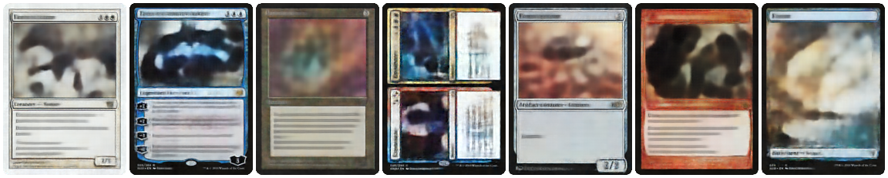

    <h1 align="center">🧙‍♂️ Magic The Gathering ✨ 🖌️ Generators ‍🎨</h1>
    

        Various machine learning models for generating MTG cards.
    

 

    
    

        <i>Example reconstructions of dataset elements using a simple <a href="https://github.com/nmichlo/disent">Beta-VAE</a></i>
    

 

## 📋 &nbsp;Features

**Generative Models**
- Beta-VAE
- NVAE (TODO)
- Basic GAN (TODO)
- StyleGAN2 (TODO)
- Improved Denoising Diffusion Model (TODO)

 

## ⬇️ &nbsp;Download Images

Images need to be downloaded and pre-processed from [images](https://scryfall.com/docs/api/images)
using [mtg-dataset](https://github.com/nmichlo/mtg-dataset).

 

## 🏃️ &nbsp;Usage

- _Coming Soon_
